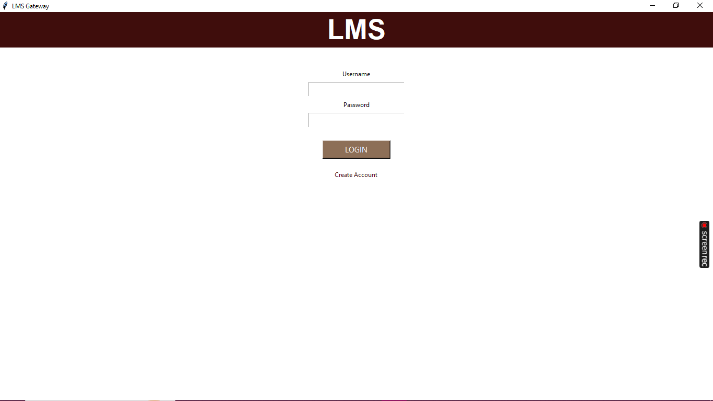
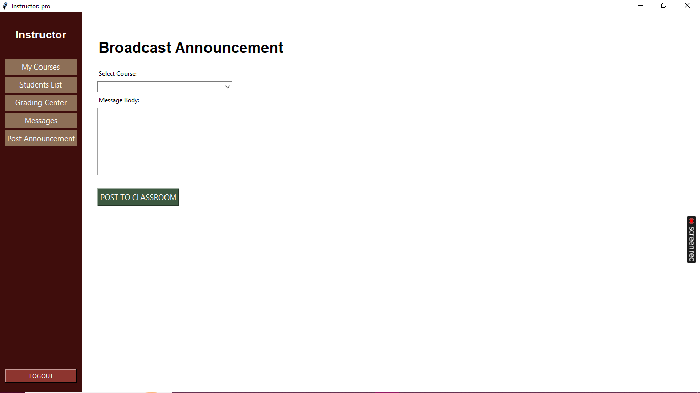
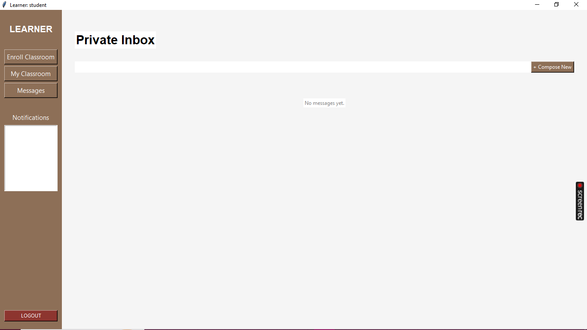
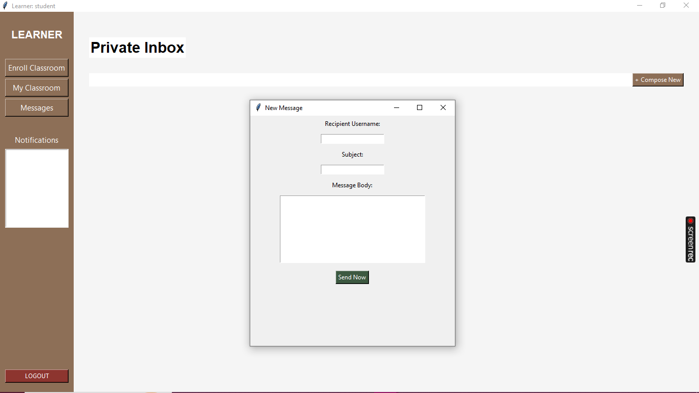

# Learning Management System 🎓


Learning Management System is a desktop-based LMS built with Python, Tkinter, and SQLite. It was developed as a university course graduation project and provides separate workflows for admins, instructors, and students in one local application.

The project focuses on core LMS concepts: user authentication, role-based dashboards, course management, classroom enrollment, learning materials, assignments, grading, reports, notifications, messages, and local data persistence.

## 📸 Screenshots

### General

| Login | Create Account |
| --- | --- |
|  |  |

### Admin Dashboard

| System Overview | User Management |
| --- | --- |
|  |  |

| Course Management | Course Analysis |
| --- | --- |
|  |  |

| Management Reports | Security Logs |
| --- | --- |
|  |  |

### Instructor Dashboard

| Manage Courses | Add Material |
| --- | --- |
|  |  |

| Add Assignment | Grading Center |
| --- | --- |
|  |  |

| Announcements |
| --- |
|  |

### Student Dashboard

| My Classrooms | Enroll Courses |
| --- | --- |
|  |  |

| Inbox | Messages |
| --- | --- |
|  |  |

## ✨ Features

### Authentication and Roles

- Login with stored local user accounts.
- Create new Student or Instructor accounts.
- Validate Gmail addresses and minimum password length.
- Route each user to a dedicated dashboard based on role.

### Admin

- View system statistics for users, courses, and students.
- Manage users and remove non-admin accounts.
- Create and delete courses.
- Assign courses to instructors.
- Review system security logs.
- View global course analytics.
- Generate user audit reports.

### Instructor

- View assigned courses.
- Upload lecture materials with optional file attachments.
- Create assignments with deadlines and max marks.
- Post course announcements.
- Review pending student submissions.
- Assign grades and notify students.
- Send and receive private messages.
- Generate individual student progress reports.

### Student

- Browse available courses.
- Enroll in classrooms.
- Open classroom tabs for announcements, materials, and assignments.
- Submit assignment work.
- View grades after instructor evaluation.
- Receive notifications.
- Send and receive private messages.

### Data Persistence

- Store users, courses, enrollments, materials, assignments, submissions, messages, notifications, announcements, logs, and grades in `lms_data.db`.
- Rebuild default accounts and starter data when the database is empty.

## 🛠️ Tech Stack

- **Python** - core programming language
- **Tkinter / ttk** - desktop GUI
- **SQLite** - local database persistence
- **ABC / OOP** - abstract reports/content models, inherited user roles, and encapsulated user data

## ⚙️ How It Works

1. The app starts from `main.py` and creates one shared `LMS` system object.
2. `LMS` loads users, courses, messages, submissions, and logs from SQLite.
3. Users log in through the authentication window.
4. The app opens the correct dashboard for Admin, Instructor, or Student.
5. Each dashboard updates the shared LMS state.
6. Changes are saved back to `lms_data.db`.

## 🔐 Default Accounts

| Role | Username | Password |
| --- | --- | --- |
| Admin | `admin` | `admin123` |
| Instructor | `pro` | `pro123` |
| Student | `student` | `stud123` |

## 📦 Installation

### 1. Clone the Repository

```bash
git clone https://github.com/seiffayed/LMS.git
cd LMS
```

### 2. Run the App

Tkinter and SQLite are included with most Python installations, so no third-party packages are required.

```bash
python main.py
```

## 📁 Project Structure

```text
LMS/
|-- gui/
|   |-- admin_gui.py
|   |-- auth_gui.py
|   |-- base_window.py
|   |-- instructor_gui.py
|   `-- student_gui.py
|-- images/
|   |-- admin/
|   |-- INSTRUCTOR/
|   `-- student/
|-- models/
|   |-- abc_models.py
|   |-- content_models.py
|   |-- course_models.py
|   |-- database_manager.py
|   |-- lms_system.py
|   |-- report_models.py
|   `-- user_models.py
|-- color.py
|-- validators.py
|-- main.py
|-- lms_data.db
|-- README.md
`-- .gitignore
```

## 🧱 Architecture Notes

- **Role inheritance:** `Admin`, `Instructor`, and `Student` inherit from a shared `User` base class.
- **Abstraction:** reports and content models use abstract base classes.
- **Encapsulation:** sensitive fields such as passwords and assignment grades are stored as private attributes.
- **Persistence layer:** `DatabaseManager` handles SQLite table creation, saving, and loading.
- **GUI separation:** each role has its own Tkinter dashboard module.

## 👥 Team Members

| Member | ID | Main Contribution |
| --- | --- | --- |
| Shahd Hamdy | 120230070 | Database management and main app setup |
| Ahmed Osama | 120230014 | Instructor GUI |
| Hala Mostafa | 120230148 | Student GUI |
| Seif Fayed | 120230091 | Admin GUI and report models |
| Marisia Michael | 120230233 | Colors, validation, base window, LMS system, auth GUI |
| Mariam Gamal | 120230012 | ABC models, content models, user models, course models |

## 📌 Notes

This was built as an academic project, so it is intentionally local-first and lightweight. It is suitable for demonstrating Python OOP, GUI development, SQLite persistence, and LMS workflow design.
